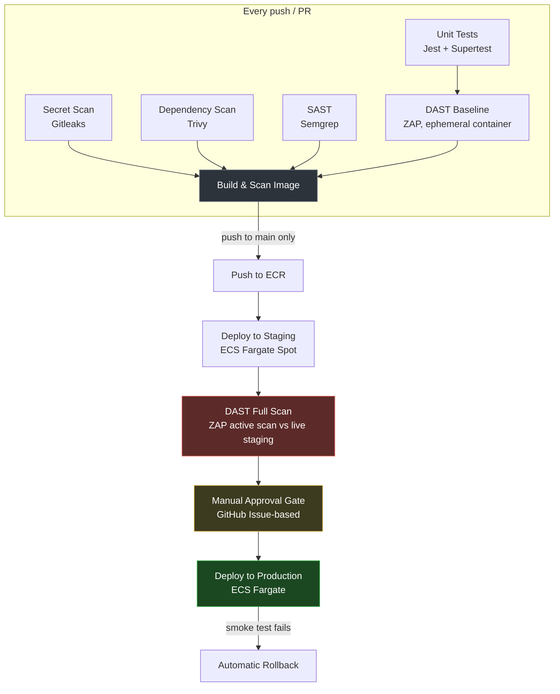

# Secure CI/CD Pipeline on AWS ECS Fargate

A CI/CD pipeline for a containerized Node.js app, deployed to
AWS ECS Fargate via GitHub Actions — with a full security gate chain
(secrets scanning, SCA, SAST, DAST) and a two-environment promotion flow with
a manual approval gate before production.

A portfolio project to demonstrate DevSecOps practices

## Architecture



One VPC, one ALB, one ECS cluster — staging and production run as separate
ECS services sharing the load balancer on different ports, so the whole
two-environment setup costs roughly what a single environment would.

## Pipeline stages

| Stage | Tool | What it catches | Blocks the build? |
|---|---|---|---|
| Secret scan | [Gitleaks](https://github.com/gitleaks/gitleaks) | Committed credentials | Yes |
| Dependency scan (SCA) | [Trivy](https://github.com/aquasecurity/trivy) | Known CVEs in `node_modules` | Yes (CRITICAL/HIGH, fixable only) |
| SAST | [Semgrep](https://semgrep.dev/) | Unsafe code patterns, OWASP Top 10 | Yes |
| Unit tests | Jest + Supertest | Functional correctness, security-header regressions | Yes |
| DAST (baseline) | [OWASP ZAP](https://www.zaproxy.org/) | Passive scan against an ephemeral container, every PR | No (report only) |
| Image scan | Trivy | OS/library CVEs in the built container | Yes |
| SBOM | Trivy (CycloneDX) | Full manifest of everything in the image | — |
| DAST (full) | OWASP ZAP | **Active** scan against live staging — real attack payloads | Yes |

Every scanner reports in two formats: SARIF for future code-scanning
integration, plus a plain-text/table report uploaded as a workflow artifact —
so results are readable without needing GitHub Advanced Security (a paid
feature this repo doesn't rely on).

## Proof of Concept(Screenshots)
### Deployment Overview


### AWS VPC


### ECS Cluster Service


### Application Endpoint
- /


- /health


- /version


## Environment promotion

- **Staging** deploys automatically on every push to `main`, runs on Fargate
  Spot (~70% cheaper), and is where the full DAST attack scan runs.
- **Production** only deploys after staging's DAST scan passes *and* a human
  approves — implemented via a GitHub Issue-based approval gate as an alternative
  for GitHub's native required-reviewers feature due to cost.
- Production deploys record the previous task definition before rolling out,
  and automatically roll back to it if the post-deploy smoke test fails.

## Security decisions worth noting

- **Every third-party GitHub Action is pinned to a full commit SHA**, not a
  mutable version tag — a direct response to the real `trivy-action`
  supply-chain compromise (March 2026), where 76 of 77 version tags were
  force-pushed to malicious commits.
- **OIDC, not static AWS keys.** The GitHub Actions role is assumed per-run
  via GitHub's OIDC provider, scoped tightly by the JWT `sub` claim to this
  specific repository.
- **Least-privilege IAM.** The deploy role can only read/register task
  definitions (an AWS API limitation — no scoping possible), update two
  *named* ECS services, and pass exactly two specific IAM roles to ECS.
- **PRs never get AWS credentials.** Building and scanning the image happens
  entirely against a local Docker tag; AWS auth only happens on the actual
  push-to-`main` path that pushes to ECR.
- **Non-root container, stripped build tooling.** The final image runs as the
  `node` user and has `npm`/`npx` removed post-build, eliminating CVEs that
  live in tooling never used at runtime.

## Real issues found and fixed by this pipeline

The DAST full-scan stage against a live staging deployment caught genuine
findings, not synthetic ones — the kind of thing header-only linting doesn't:

- Missing `X-Content-Type-Options`, leaking `X-Powered-By`, no
  `Permissions-Policy` — fixed via [Helmet](https://helmetjs.github.io/).
- A subtler one: Express's built-in `finalhandler` was **silently overwriting**
  Helmet's Content-Security-Policy header (`default-src 'none'`) on any
  unmatched route (e.g. `/robots.txt`), dropping the `frame-ancestors`,
  `base-uri`, and `form-action` directives that don't fall back to
  `default-src`. Fixed with an explicit catch-all 404 handler, and pinned in
  place with a regression test so it can't silently come back.

## Tech stack

**App:** Node.js 24, Express 5, Helmet
**Infra:** Terraform (`terraform-aws-modules`), AWS ECS Fargate, ALB, ECR
**CI/CD:** GitHub Actions, OIDC-based AWS auth
**Security:** Gitleaks, Trivy, Semgrep, OWASP ZAP
**Testing:** Jest, Supertest

## Running it locally

```bash
cd app
npm install
npm test
npm start
```

Or via Docker, matching exactly what CI builds:

```bash
docker build -t app:local .
docker run -p 3000:3000 app:local
curl http://localhost:3000/health
```

## Limitations

This is a deliberately cheap, single-account setup for portfolio purposes only.
It is worth mentioning what are the things we could change in industry standard
setup:

- **Separate AWS accounts per environment** this project uses a single account setup
- **GitHub's native required-reviewers** this project uses an issue-based approval
  workaround
- A **host-based ALB routing / Domain** this projects seperates the two environment
  URLS using ports.
